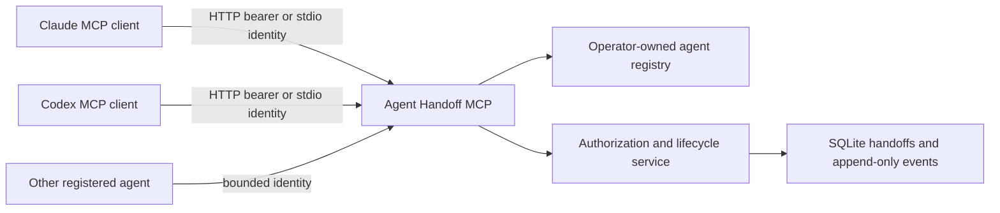

# Architecture

## Layers

`registry.ts` parses the operator-owned identity and communication policy into immutable, strictly validated snapshots identified by a content revision. The registry file is re-checked by mtime on every operation, so disabling an identity or narrowing a relationship takes effect on live sessions without a restart. A failed reload keeps the last valid snapshot active and marks the provider degraded, which `/healthz` and `/readyz` expose.

`service.ts` resolves a request-scoped principal against one policy snapshot for every tool call and owns participant authorization, disclosure checks, historical-read denial, message limits, and the public handoff operations.

`store.ts` owns SQLite schema, transactions, idempotency, lifecycle transitions, and the event history. SQL statements are fixed and parameterized.

`server.ts` maps the service to six MCP tools with strict Zod input schemas.

`http.ts` provides a shared Streamable HTTP service with hashed bearer-token verification, host/origin validation, rate limiting, security headers, body limits, and bounded timeouts. `app.ts` holds the composable application factory used by both the entry point and the end-to-end tests.

`stdio.ts` provides local process transport. Identity comes from `HANDOFF_AGENT_ID`; the client configuration is therefore part of the trust boundary. The identity is verified at startup and re-verified against the current policy on every call.

`cli.ts` is the `agent-handoff-mcp` dispatcher: server entry points plus registry provisioning (`init`, `issue`, `rotate`, `enable`, `disable`, `revoke`, `validate`, `token`).

## Storage choice

SQLite keeps the first deployment operationally small while providing transactions, indexes, concurrent WAL readers, and a clean migration path. The service/store boundary permits a future Postgres adapter without changing MCP tools.

Operational database files and real agent registries are intentionally ignored by Git.

## Public engine and private deployment

The public repository owns the generic protocol and implementation. A private deployment repository can depend on it and add real identities, secrets, infrastructure, private context conventions, and operator runbooks. This avoids maintaining a private fork of the engine.
