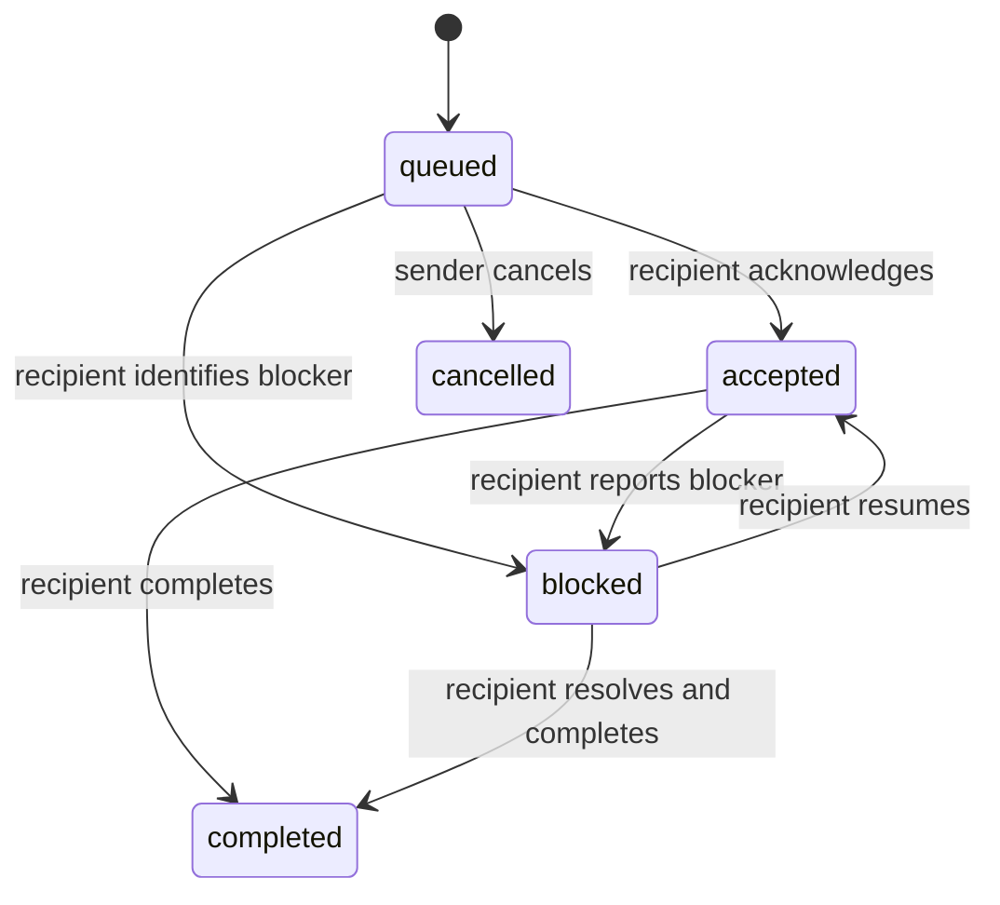

# Handoff protocol

## Object

A handoff is a request from one registered identity to one registered recipient. It contains:

- opaque `id`, `thread_id`, and optional `parent_id`
- sender and recipient identities
- title, summary, and explicit request
- inert context and artifact references
- tags, priority, and sensitivity
- lifecycle status and timestamps
- optional sender-scoped idempotency key

The handoff is not a prompt transcript. It should contain only the minimum context needed to accept or route the work. Large source material remains in its authoritative system and is referenced.

## Lifecycle

Completed and cancelled handoffs are terminal in v1. There is no delete operation.

## Authorization

Both sides must allow the relationship:

1. The sender's `send_to` includes the recipient or `*`.
2. The recipient's `receive_from` includes the sender or `*`.
3. Both identities are enabled.
4. The requested sensitivity is at or below both disclosure ceilings.

Only the sender and recipient may read the handoff or event history. Only the recipient may accept, block, or complete. Only the sender may cancel, and only while queued.

## Replies and loop control

A response that needs new work is a new handoff with `parent_id`, not a mutation of the original request. The child inherits the thread identifier and increments depth.

The server rejects chains deeper than `HANDOFF_MCP_MAX_HANDOFF_DEPTH`. This limits accidental agent ping-pong but does not replace operator policy. Clients should also:

- avoid automatic reply-on-receipt behavior
- require new substance before creating a child handoff
- reuse an idempotency key when retrying the same send
- stop and involve an operator when a blocker repeats

## Delivery semantics

Creation is durable once the SQLite transaction commits. Listing an inbox does not acknowledge work. `handoff_send` is at-least-once from the caller's perspective; supply `idempotency_key` to make retries converge on one stored handoff.

The server provides pull-based delivery. Notifications and webhooks are deliberately outside v1.
